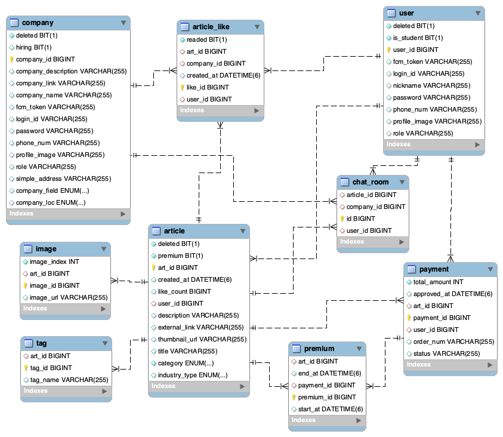

# Port-It Backend
> 작품(포트폴리오) 기반 AI 구직·채용 플랫폼 **Port-It의 백엔드 서버 레포지토리**입니다.

## 📑 목차

- [Port-It Backend](#port-it-backend)
- [시스템 아키텍처](#시스템-아키텍처)
- [Database Schema (ERD)](#database-schema-erd)
- [기술 스택](#기술-스택)
- [기능 목록](#기능-목록)
- [API Reference](#api-reference)

## 시스템 아키텍처

## Database Schema (ERD)

## 기술 스택
### Spring Boot
- version : 3.3.12
- java : 17
- Gradle - Groovy 
- Java
- Spring Security
- WebSocket(STOMP)
- QueryDSL

### DB
- AWS RDS(MySQL)
- MongoDB
- Redis

### Infra
- AWS(EC2, S3)

## 기능 목록

| 구분 | 기능 |
|------|------|
| **회원/인증 관리** | 유저 및 기업 회원가입, 로그인, 로그아웃, JWT 인증, 토큰 재발급 |
| **작품 관리** | 작품 등록, 수정, 삭제, 조회, 태그 생성 |
| **기업 관리** | 공공데이터 기반 기업 등록, 기업 정보 관리, 작품 좋아요 |
| **결제** | 토스 결제 연동, 결제 정보 관리 |
| **프리미엄 관리** | 작품 프리미엄 등록 및 조회 |
| **채팅** | 실시간 채팅방 생성, 입장, 퇴장, 채팅 목록 조회 |
| **알림** | FCM 기반 푸시 알림 및 알림 관리 |
| **SMS/이메일 인증** | 휴대폰 및 이메일 인증번호 발송 및 검증 |

## API Reference

